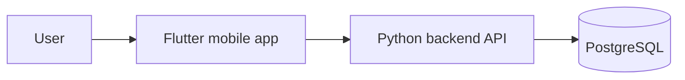

# Design Document: Valores

> **Status:** In development (design phase, nothing built yet)
> **Last update:** 2026-09-30
> **Author:** Krzysztof Sokołowski

<!-- Items marked "Open question" or "Proposed" are decisions I have not locked in yet. Update them as I go. -->

---

## 1. Goal and context

**Problem.** Most dating and friendship apps start with a photo. Before you know anything about a person, you have already decided whether you like how they look. I've been there myself: I got into relationships because I was physically attracted to someone, not because we shared the same values. And I don't think I'm the only one. Many people say they want to get to know someone's character first, but the apps they use are built the other way around.

**Solution.** Valores is a mobile app where you meet people through *who they are*, not how they look. Every user builds an **aesthetic board**: a personal diagram of their life in essence, including what they believe in, what they care about, the books they read, the films they watch, what they do in their free time, and how they feel about life. Users decorate their board however they like, so it is also an expression of style.

**Who it's for.** People aged 16-30 who want to make new friends based on shared values and interests. The app is about friendship first. Dating can happen naturally, but it is not the goal.

**Why it's different.** Apps such as S'More, BlindLove or Lovetastic hide photos and reveal them later. Valores goes a step further: there are no photos at all, and the thing you swipe on is a rich, personal, visual board instead of a short bio.

## 2. Scope

I have about one month, so the MVP is deliberately small.

### In scope (MVP)
- [ ] Account creation and a simple profile (nickname, one-sentence intro)
- [ ] Aesthetic board editor (add and arrange blocks, choose a look)
- [ ] Swiping: a card with a one-sentence intro, tap to open the full board, "+" to show interest, skip to move on
- [ ] Matching: when two people both press "+", they are matched
- [ ] Chat between matched users
- [ ] Basic safety tools: report and block

### Out of scope (for now)
- Photo reveal. Valores has no photos in the MVP. Users can exchange Instagram or other contacts in chat if they want to.
- Social-media-style feed. It would be cool, but it is not needed to test the idea.
- Ads and daily swipe limits (see Business model).
- Filtering people by beliefs (see Open questions).
- Recommendation algorithm. In the MVP, cards are shown in simple order.

## 3. Requirements

### Functional
| ID | Requirement | Priority |
|----|-------------|----------|
| F1 | User can create an account and a profile with a one-sentence intro | Must |
| F2 | User can create and edit an aesthetic board | Must |
| F3 | User can swipe through cards and open another user's board | Must |
| F4 | Two users who both pressed "+" are matched | Must |
| F5 | Matched users can chat | Must |
| F6 | User can report and block another user | Should |
| F7 | User can delete their account and all data | Should |

### Non-functional
- **Privacy:** beliefs on a board can be sensitive (religion, politics), so those blocks are optional and never required.
- **Cost:** must run almost free at the beginning; expected backend cost of roughly 100 PLN/month only at large scale.
- **Platforms:** Android first, iOS later (same Flutter codebase).
- **Safety:** see section 8.

## 4. Architecture

**Proposed:** the backend is a REST API (FastAPI). Chat starts as simple polling or WebSocket. Serverless functions on Google Cloud are an option to keep costs low.

| Component | Responsibility | Technology |
|-----------|----------------|------------|
| Mobile app | UI, board editor, swiping, chat | Flutter |
| Backend | Auth, profiles, boards, matching, chat | Python (FastAPI) |
| Database | Persistent data | PostgreSQL (proposed) |
| Hosting | Run the backend | Google Cloud (serverless) |

## 5. Key technical decisions

### Decision 1: Flutter for the frontend
- **Choice:** Flutter.
- **Why:** one codebase for Android and iOS, and I already have an Android developer account. A dating/friendship app works best as a mobile app.

### Decision 2: Python for the backend
- **Choice:** Python (FastAPI).
- **Why:** I already know it and it is very fast for prototyping, which matters with a one-month deadline.
- **Trade-off:** not the fastest option at scale, but that is a problem for later.

### Decision 3: Chat storage
- **Open question.** My first idea was one database record per conversation. The concern is that a growing conversation makes a single record heavy and hard to update safely. **Proposed:** one row per message (`MESSAGE` table above), which is simple and scales fine.

## 7. Business model

Not part of the MVP, but the plan is:
- Free to use at the start (I need users before I need revenue).
- Later: a daily swipe limit (for example 20 per day) with optional premium, and occasional ads (for example every 10 swipes).
- **Risk:** limiting swipes and showing ads before the app has enough users could push people away, so this comes only after there is a community.

## 8. Safety and privacy

This is the most important section to get right, because Valores connects strangers.

- **Age.** The target group is 16-30, and there is currently no age verification. Mixing 16-17-year-olds with adults in a stranger-matching app is a real risk. **Open question / Proposed:** match users only within similar age bands (for example 16-17 with 16-17, 18+ with 18+) and ask for date of birth at sign-up.
- **Personal data.** Even with a nickname instead of a real name, a board is linked to an account, so it is still personal data. Religion and political views are also "special category" data under GDPR, which needs explicit consent. **Plan:** keep those blocks optional, ask for consent when they are added, and let users delete their data at any time.
- **Moderation.** Report and block from day one. Boards contain only text and a closed set of images, so no user photos can be uploaded.
- **No photos** also means less exposure of identity, which is a privacy advantage.

## 9. Go-to-market

**Open question:** I don't yet know how to get the first users. **Proposed:** start in one city and one small community (for example a single school, university or interest group) and aim for about 100 real users before expanding. A small, dense group makes the app useful much faster than a scattered one.

## 10. Testing

- Unit tests for matching logic (mutual "+" creates one match).
- Manual testing of the board editor and chat on a real Android phone.
- A small test with 5-10 friends to see if they understand the board and would actually use it.

## 11. Known limitations and risks

- Nothing is built yet, and I have about one month.
- The biggest risk is getting the first users (cold start).
- An aesthetic board can still be a performance. People may present a curated version of themselves, so the board has to be quick and simple to fill in honestly.
- No age verification yet (see section 8).
- No decision yet on filters. I don't want to discriminate against anyone, but people often want to meet "their own" people.

## 12. Roadmap

| Stage | Scope | Status |
|-------|-------|--------|
| v0.1 | Accounts, board editor, swiping, matching, chat | Planned (1 month) |
| v0.2 | Safety features, age bands, better board styling | Planned |
| v0.3 | Small pilot in one city or community | Planned |
| v1.0 | Public release on Android, then iOS | Planned |
| Later | Optional photo reveal, filters, premium, ads | Idea |

## 13. Change log

| Date | Change |
|------|--------|
| 2026-09-30 | First version of the document |